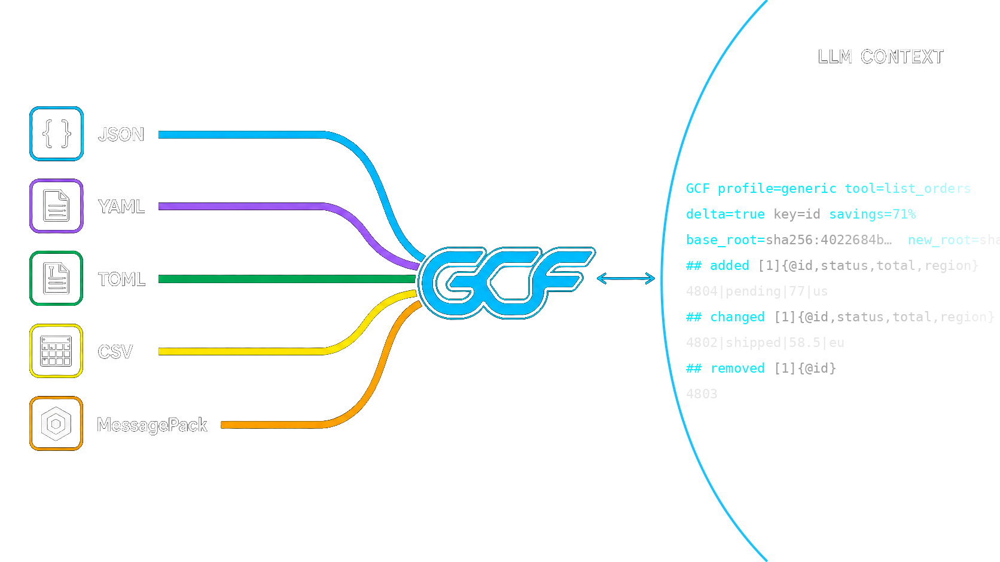

<p align="center">
  
</p>

<p align="center">
  <a href="https://gcformat.com/playground.html"></a>
  <a href="https://gcformat.com/guide/benchmarks.html"></a>
  <a href="https://jitpack.io/#blackwell-systems/gcf-kotlin"></a>
  <a href="LICENSE"></a>
</p>

# gcf-kotlin

Kotlin/JVM implementation of [GCF](https://gcformat.com/) -- the most token-efficient wire format for LLMs. A drop-in alternative to JSON and TOON for any structured data.

**Built for the agentic loop, where the same structured context crosses the model boundary turn after turn.** A single payload is 50-92% smaller than JSON, but GCF also deduplicates repeated structure across turns and sends only deltas when context changes, so by the 5th overlapping call each response costs 99% fewer tokens than JSON, and a 10-call session runs 94.4% cheaper than re-sending JSON every turn. Session dedup and delta both need local IDs and a multi-turn design that neither JSON nor TOON has.

- **100% comprehension on every frontier model**, zero training. 29% fewer tokens than TOON and 56% fewer than JSON across 16 datasets; 91.2% on structurally complex code graphs (vs TOON 68.8%, JSON 54.1%).
- **Proven lossless** across 43,000,000,000+ round-trips in 5 formats and 6 languages. Zero runtime dependencies.
- **One format, four properties no other single format holds at once:** schema-free, lossless, token-compact (50-92% vs JSON), and model-readable with zero training. JSON is verbose, Protobuf needs a schema, MessagePack is binary, and TOON isn't reliably lossless.

2,500+ LLM evaluations. [Full benchmarks](https://gcformat.com/guide/benchmarks.html).

Docs: [gcformat.com](https://gcformat.com/) · [Playground](https://gcformat.com/playground.html) · [GCF vs TOON](https://gcformat.com/guide/vs-toon.html)

## Install

Add the JitPack repository, then the dependency:

### Gradle (Kotlin DSL)

```kotlin
repositories {
    maven("https://jitpack.io")
}

dependencies {
    implementation("com.github.blackwell-systems:gcf-kotlin:v2.4.0")
}
```

### Gradle (Groovy)

```groovy
repositories {
    maven { url 'https://jitpack.io' }
}

dependencies {
    implementation 'com.github.blackwell-systems:gcf-kotlin:v2.4.0'
}
```

### Maven

```xml
<repositories>
    <repository>
        <id>jitpack.io</id>
        <url>https://jitpack.io</url>
    </repository>
</repositories>

<dependency>
    <groupId>com.github.blackwell-systems</groupId>
    <artifactId>gcf-kotlin</artifactId>
    <version>v2.4.0</version>
</dependency>
```

Don't want to change code? Use the [MCP proxy](https://github.com/blackwell-systems/gcf-proxy) for zero-code adoption.

## Quick Start

```kotlin
import com.blackwellsystems.gcf.*

val output = encodeGeneric(mapOf(
    "employees" to listOf(
        mapOf("id" to 1, "name" to "Alice", "department" to "Engineering", "salary" to 95000),
        mapOf("id" to 2, "name" to "Bob", "department" to "Sales", "salary" to 72000),
    )
))
```

Output:
```
## employees [2]{department,id,name,salary}
Engineering|1|Alice|95000
Sales|2|Bob|72000
```

## Graph Profile

```kotlin
val payload = Payload(
    tool = "context_for_task", tokenBudget = 5000, tokensUsed = 1847,
    symbols = listOf(
        Symbol(qualifiedName = "pkg.Auth", kind = "function", score = 0.78, provenance = "lsp", distance = 0),
        Symbol(qualifiedName = "pkg.Server", kind = "function", score = 0.54, provenance = "lsp", distance = 1),
    ),
    edges = listOf(Edge(source = "pkg.Server", target = "pkg.Auth", edgeType = "calls"))
)
val output = encode(payload)
```

Output:
```
GCF tool=context_for_task budget=5000 tokens=1847 symbols=2 edges=1
## targets
@0 fn pkg.Auth 0.78 lsp
## related
@1 fn pkg.Server 0.54 lsp
## edges [1]
@0<@1 calls
```

## Decode

```kotlin
val p = decode(input)
println("${p.tool} ${p.symbols.size} symbols ${p.edges.size} edges")
```

Throws `DecodeException` on invalid input.

## Session Deduplication

Track transmitted symbols across multiple tool responses. Previously-sent symbols become bare references instead of full declarations:

```kotlin
val session = Session()

val out1 = encodeWithSession(payload1, session) // full declarations
val out2 = encodeWithSession(payload2, session) // reused symbols as "@N  # previously transmitted"
```

By the 5th call in a session: 86% fewer tokens than JSON from dedup alone, 99% stacked with delta encoding.

## Streaming Encode

Write GCF output incrementally as symbols and edges arrive. Zero buffering, O(1) memory per row:

```kotlin
val enc = StreamEncoder(writer, "context_for_task", StreamOptions(tokenBudget = 5000))

enc.writeSymbol(Symbol(qualifiedName = "pkg.Auth", kind = "function", score = 0.95, provenance = "lsp", distance = 0))
enc.writeEdge(Edge(source = "pkg.Server", target = "pkg.Auth", edgeType = "calls"))
enc.close()  // emits ##! summary trailer
```

Output uses `[?]` deferred counts and `##! summary` trailer. Standard `decode()` handles streaming output with no changes. Thread-safe via `@Synchronized`.

## Delta Encoding

When the consumer already has a prior context pack, send only what changed:

```kotlin
val delta = DeltaPayload(
    tool = "context_for_task",
    baseRoot = "aaa111",
    newRoot = "bbb222",
    removed = listOf(Symbol(qualifiedName = "pkg.OldFunc", kind = "function")),
    added = listOf(Symbol(qualifiedName = "pkg.NewFunc", kind = "function", score = 0.85, provenance = "rwr")),
    deltaTokens = 30,
    fullTokens = 200
)

val output = encodeDelta(delta)
```

81.2% savings on re-queries where the pack changed slightly.

## Generic Encoding

Encode any value (not just graph payloads) into GCF tabular format:

```kotlin
val data = mapOf(
    "employees" to listOf(
        mapOf("id" to 1, "name" to "Alice", "department" to "Engineering", "salary" to 95000),
        mapOf("id" to 2, "name" to "Bob", "department" to "Sales", "salary" to 72000),
    )
)
val output = encodeGeneric(data)
```

Output:
```
## employees [2]{department,id,name,salary}
Engineering|1|Alice|95000
Sales|2|Bob|72000
```

Works on maps, lists, and primitives. Arrays of uniform maps get tabular rows. Nested maps use `## key` section headers.

## Generic-Profile Delta (multi-turn)

In an agent loop the same keyed table gets re-queried turn after turn. Instead of re-sending the whole table each time, send only the changed rows (SPEC §10a):

```kotlin
val base = GenericSet(key = "id", fields = listOf("id", "status"), rows = listOf(
    mapOf("id" to 1001, "status" to "pending"),
    mapOf("id" to 1002, "status" to "shipped"),
))
val next = GenericSet(key = "id", fields = listOf("id", "status"), rows = listOf(
    mapOf("id" to 1001, "status" to "shipped"),   // changed
    mapOf("id" to 1003, "status" to "pending"),   // added (1002 removed)
))

val d = diffGenericSets(base, next)              // the blessed producer path
val wire = encodeGenericDelta(d)                 // ## added / ## changed / ## removed
val held = verifyGenericDelta(base, d, d.newRoot) // atomic apply + new_root verification
```

Opt-in and bilateral, keyed on content-addressed pack roots. By the 5th overlapping call, ~97% fewer tokens than re-sending JSON. Byte-for-byte interoperable with the Go, Python, TypeScript, Rust, and Swift SDKs.

### Re-anchor session helper

`GenericDeltaSession` manages the delta/re-anchor cadence for you: each `next()` returns either a compact delta or, on its cadence, a full re-anchor (which re-grounds the consumer), updating its held base.

```kotlin
val sess = GenericDeltaSession(base, tool = "orders", policy = ReanchorPolicy.SizeGuard)
val establish = sess.currentFull()               // transmit the base once to establish it
for (snapshot in stream) {                        // each turn's current GenericSet
    val (wire, isFull) = sess.next(snapshot)      // a compact delta, or a periodic full re-anchor
}
```

`ReanchorPolicy.FixedN(15)` re-anchors every N turns; `ReanchorPolicy.SizeGuard` (recommended) re-anchors once the cumulative delta reaches a full payload's size. It introduces no new wire syntax and the decoder stays cadence-agnostic, so a re-anchor is just the protocol's "full" outcome on a schedule. A schema change forces a full (§10a.7).

## API

| Function | Description |
|----------|-------------|
| `encode(payload: Payload): String` | Encode a graph payload to GCF text |
| `encodeGeneric(data: Any?): String` | Encode any value to GCF tabular format |
| `decode(input: String): Payload` | Parse GCF text back to a Payload |
| `encodeWithSession(payload: Payload, session: Session?): String` | Encode with session deduplication |
| `encodeDelta(delta: DeltaPayload): String` | Encode a graph delta (added/removed only) |
| `diffGenericSets(base: GenericSet, next: GenericSet): GenericDeltaPayload` | Diff two keyed record sets (generic profile) |
| `encodeGenericDelta(d: GenericDeltaPayload): String` / `decodeGenericDelta(s: String): GenericDeltaPayload` | Generic-profile delta wire (§10a) |
| `verifyGenericDelta(base: GenericSet, d: GenericDeltaPayload, root: String): GenericSet` | Atomic apply + `new_root` verification |
| `GenericDeltaSession(base, tool, policy)` | Producer-side re-anchor cadence helper (§10a.8) |
| `Session()` | Create a new session tracker (thread-safe) |

## Types

| Type | Purpose |
|------|---------|
| `Payload` | Full GCF payload: tool, budget, symbols, edges, pack root |
| `Symbol` | Graph node: qualified name, kind, score, provenance, distance |
| `Edge` | Directed relationship: source, target, edge type |
| `DeltaPayload` | Diff between two graph packs: added/removed symbols and edges |
| `GenericSet` / `GenericDeltaPayload` | Keyed record set and its generic-profile diff (§10a) |
| `GenericDeltaSession` | Stateful producer that schedules delta vs full re-anchor (§10a.8) |
| `ReanchorPolicy` | Re-anchor cadence: `FixedN(n)` or `SizeGuard` |
| `Session` | Thread-safe tracker for multi-call deduplication |
| `Components` | Score breakdown: blast radius, confidence, recency, distance |
| `DecodeException` | Thrown on invalid GCF input |
| `kindAbbrev` / `kindExpand` | Bidirectional kind abbreviation maps |

## Benchmarks

2,500+ LLM evaluations across 11 models, 4 providers, and 50+ independent test runs.

| | GCF | TOON | JSON |
|---|---|---|---|
| **Comprehension** (23 runs, 10 models) | **91.2%** | 68.8% | 54.1% |
| **Generation** (28 runs, 9 models) | **5/5** | 1.0/5 | 5.0/5 |
| **Input tokens** (500 symbols) | **11,090** | 16,378 | 53,341 |
| **Output tokens** (100 symbols) | **5,976** | 8,937 | 16,121 |

GCF wins 15/16 datasets on the expanded [token efficiency benchmark](https://github.com/blackwell-systems/toon/tree/gcf-comparison). Full results: [gcformat.com/guide/benchmarks](https://gcformat.com/guide/benchmarks.html)

## Implementations

| Language | Package | Repository |
|----------|---------|-----------|
| Go | `go get github.com/blackwell-systems/gcf-go` | [gcf-go](https://github.com/blackwell-systems/gcf-go) |
| TypeScript | `npm install @blackwell-systems/gcf` | [gcf-typescript](https://github.com/blackwell-systems/gcf-typescript) |
| Python | `pip install gcf-python` | [gcf-python](https://github.com/blackwell-systems/gcf-python) |
| Rust | `cargo add gcf` | [gcf-rust](https://github.com/blackwell-systems/gcf-rust) |
| Swift | Swift Package Manager | [gcf-swift](https://github.com/blackwell-systems/gcf-swift) |
| Kotlin | JitPack | [gcf-kotlin](https://github.com/blackwell-systems/gcf-kotlin) |
| MCP Proxy | `pip install gcf-proxy` | [gcf-proxy](https://github.com/blackwell-systems/gcf-proxy) (bidirectional, session dedup, HTTP frontend) |
| Claude Code Plugin | `/plugin install` | [gcf-claude-plugin](https://github.com/blackwell-systems/gcf-claude-plugin) (one-command install, session stats hook) |
| Codex Plugin | `codex plugin add` | [gcf-codex-plugin](https://github.com/blackwell-systems/gcf-codex-plugin) (one-command install, session stats hook) |
| VS Code | `ext install blackwell-systems.gcf-vscode` | [gcf-vscode](https://marketplace.visualstudio.com/items?itemName=blackwell-systems.gcf-vscode) (syntax highlighting) |
| n8n | `npm install n8n-nodes-gcf` | [gcf-n8n-nodes](https://github.com/blackwell-systems/gcf-n8n-nodes) (workflow encode/decode) |
| Tree-sitter | `npm install tree-sitter-gcf` | [tree-sitter-gcf](https://github.com/blackwell-systems/tree-sitter-gcf) |

**Zero runtime dependencies. Permanently.** All six implementations depend only on their language's standard library. No transitive dependencies. No supply chain risk. This is a permanent commitment: GCF will never take on external runtime dependencies. MIT licensed. All implementations support both generic profile (`encodeGeneric`) and graph profile (`encode`). CLI included in all 6 languages.

**Specification:** [SPEC v3.4.1 Stable](https://github.com/blackwell-systems/gcf/blob/main/SPEC.md) with 204 conformance fixtures, 43,000,000,000+ lossless round-trips verified across 5 formats and 6 languages. All implementations at v2.4.0+ (Go v1.5.0). Cross-language 6x6 matrix verified.

## Adopted by

[Chrome DevTools MCP](https://github.com/ChromeDevTools/chrome-devtools-mcp) (46K stars, Google Chrome DevTools team) · [Speakeasy](https://speakeasy.com) (API tooling, customers include Google, Verizon, Mistral AI, DocuSign, Vercel) · [OmniRoute](https://omniroute.online) (6.1K stars) · [NetClaw](https://github.com/automateyournetwork/netclaw) (556 stars) · [ctx](https://github.com/stevesolun/ctx) (510 stars) · [NeuroNest](https://neuronest.cc) · [Open Data Products SDK](https://opendataproducts.org/sdk/) (Linux Foundation) · [Raycast](https://raycast.com/blackwell-systems/json-to-gcf-converter) · [and more](https://gcformat.com/ecosystem/adopters.html)

## License

MIT - [Dayna Blackwell](https://github.com/blackwell-systems)
